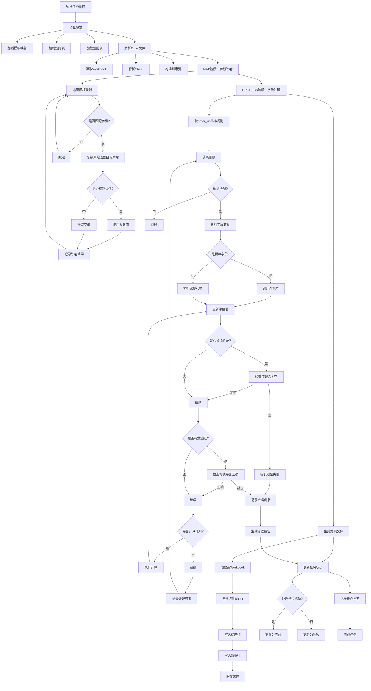

# 派送文件生成设计文档

## 1. 流程图

## 2. 流程说明

### 2.1 触发任务执行
- 当用户创建新任务并上传文件后，系统自动触发任务执行
- 或用户在任务详情页面点击"重跑任务"按钮时触发

### 2.2 加载配置
- **模板映射**：定义源文件字段到目标文件字段的映射关系
- **规则表**：定义不同文件类型和处理阶段的规则集合
- **规则项**：具体的字段处理规则，包括验证、转换、计算等

### 2.3 解析Excel文件
- 读取上传的Excel文件，获取Workbook对象
- 解析指定的Sheet，提取数据行
- 构建列索引，方便后续快速访问字段值

### 2.4 MAP阶段：字段映射
- 根据模板映射表，将源文件中的字段值复制到目标文件对应的字段
- 处理默认值：如果源字段为空且配置了默认值，则使用默认值
- 记录映射结果，用于后续PROCESS阶段的处理

### 2.5 PROCESS阶段：字段处理
- **规则排序**：按照order_no字段对规则进行排序，确保规则按正确顺序执行
- **规则匹配**：根据executor_type、field_type、transformation_type等条件匹配规则
- **字段转换**：
  - AI字段：调用AI能力进行处理
  - 常规字段：执行格式化、计算、验证等转换
- **验证处理**：
  - 必填验证：检查必填字段是否为空
  - 格式验证：检查字段格式是否符合要求
- **计算规则**：执行字段间的计算逻辑
- **错误处理**：记录验证或转换过程中出现的错误

### 2.6 生成结果文件
- 创建新的Excel Workbook
- 写入处理后的数据
- 保存结果文件到指定位置

### 2.7 更新任务状态
- 根据处理结果更新任务状态：
  - 处理成功：更新为"完成"
  - 处理失败：更新为"失败"

### 2.8 记录操作日志
- 记录任务执行的详细日志，包括：
  - 执行时间
  - 执行结果
  - 处理的数据量
  - 错误信息（如果有）

## 3. 核心概念

### 3.1 模板映射
- 定义源文件与目标文件之间的字段对应关系
- 支持设置默认值
- 用于MAP阶段的数据迁移

### 3.2 规则表
- 按文件类型和处理阶段组织规则
- 包含多个规则项
- 支持灵活配置不同文件类型的处理逻辑

### 3.3 规则项
- 定义具体的字段处理规则
- 包含：
  - 执行顺序（order_no）
  - 执行类型（executor_type）
  - 字段类型（field_type）
  - 转换类型（transformation_type）
  - 规则参数
- 支持AI字段处理

### 3.4 三维规则执行
- **WHO**：执行器类型（executor_type）
- **WHAT**：字段类型（field_type）
- **HOW**：转换类型（transformation_type）
- 通过三维匹配确定适用的规则

## 4. 数据流向

1. **输入**：用户上传的原始Excel文件
2. **处理**：
   - MAP阶段：字段映射，数据从源结构迁移到目标结构
   - PROCESS阶段：字段处理，应用各种规则进行验证、转换和计算
3. **输出**：
   - 处理成功：生成的结果Excel文件
   - 处理失败：错误报告
4. **状态更新**：任务状态更新为完成或失败
5. **日志记录**：记录完整的处理日志

## 5. 关键技术点

- **Excel处理**：使用openpyxl库读取和写入Excel文件
- **配置驱动**：通过模板映射和规则配置实现灵活的文件处理
- **多阶段处理**：分为MAP和PROCESS两个阶段，职责明确
- **规则引擎**：支持复杂的规则匹配和执行
- **AI集成**：支持调用AI能力处理特定字段
- **错误处理**：完善的错误记录和报告机制
- **事务管理**：确保任务执行的原子性

## 6. 扩展能力

- 支持新增模板映射，无需修改代码
- 支持新增规则，扩展处理能力
- 支持新增文件类型，通过配置实现
- 支持AI能力的扩展，轻松集成新的AI模型
- 支持自定义转换类型，满足特殊业务需求

## 7. 性能考虑

- **批量处理**：支持一次性处理多个文件
- **并行执行**：支持多任务并行处理
- **内存优化**：采用流式处理，减少内存占用
- **缓存机制**：缓存配置信息，减少数据库访问

## 8. 监控与维护

- **任务监控**：实时监控任务执行状态
- **日志查询**：支持查询和分析任务执行日志
- **错误告警**：处理失败时自动告警
- **性能统计**：统计任务执行时间、成功率等指标

## 9. 安全考虑

- **文件安全**：严格的文件上传和下载权限控制
- **数据安全**：加密存储敏感数据
- **访问控制**：基于角色的访问控制
- **审计日志**：记录所有操作，便于追溯

## 10. 部署架构

- **容器化部署**：支持Docker容器化部署
- **微服务架构**：可扩展为微服务架构
- **云原生支持**：支持部署到云平台
- **高可用性**：支持集群部署，确保服务可用性

## 11. 测试策略

- **单元测试**：测试各个组件的功能
- **集成测试**：测试组件之间的集成
- **端到端测试**：测试完整的任务执行流程
- **性能测试**：测试系统的性能和吞吐量
- **压力测试**：测试系统在高负载下的表现

## 12. 版本管理

- **配置版本**：支持配置的版本管理
- **规则版本**：支持规则的版本管理
- **模板版本**：支持模板的版本管理
- **回滚机制**：支持配置和规则的回滚

## 13. 文档管理

- **配置文档**：详细的配置说明文档
- **规则文档**：详细的规则说明文档
- **API文档**：完整的API接口文档
- **用户手册**：用户使用指南
- **开发手册**：开发人员指南

## 14. 培训计划

- **管理员培训**：系统管理员培训
- **用户培训**：终端用户培训
- **开发培训**：开发人员培训
- **维护培训**：系统维护培训

## 15. 上线计划

- **试点阶段**：小范围试点
- **推广阶段**：逐步推广到更多用户
- **优化阶段**：根据用户反馈进行优化
- **稳定阶段**：系统稳定运行

## 16. 后续规划

- **功能扩展**：根据业务需求扩展功能
- **性能优化**：持续优化系统性能
- **AI能力增强**：集成更多AI能力
- **用户体验改进**：不断改进用户体验
- **生态建设**：构建完整的生态系统

## 17. 总结

本设计文档详细描述了派送文件生成的完整流程，包括流程图、流程说明、核心概念、数据流向、关键技术点、扩展能力、性能考虑、监控与维护、安全考虑、部署架构、测试策略、版本管理、文档管理、培训计划、上线计划和后续规划。

该设计采用了配置驱动的架构，通过模板映射和规则配置实现灵活的文件处理，支持多阶段处理、规则引擎、AI集成等先进技术，具有良好的扩展性、性能和安全性。

系统的部署架构支持容器化部署和微服务架构，便于扩展和维护。测试策略确保了系统的质量和可靠性。版本管理和文档管理便于系统的维护和升级。培训计划和上线计划确保了系统的顺利推广和使用。后续规划为系统的持续发展提供了方向。